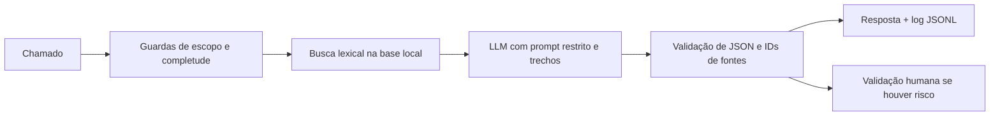

# MM Compass

Assistente de triagem de chamados para **SAP S/4HANA MM**, no processo pedido de compra → entrada de mercadorias → verificação de fatura. É uma prova de conceito com oito chamados fictícios e cinco artigos locais baseados em documentação oficial SAP. O assistente interpreta o relato, recupera evidências, gera uma orientação com LLM e sinaliza quando deve perguntar ou encaminhar a um consultor.

> O protótipo não se conecta ao SAP e não executa liberações, lançamentos ou alterações. Números de documentos e situações dos chamados são fictícios.

## Executar em cinco minutos

Requer Python 3.10+. Há duas opções de LLM: API OpenAI com chave ou Ollama local. O cliente usa a interface Chat Completions com `response_format: json_object`.

```bash
git clone https://github.com/rg97417/sap-mm-compass.git
cd sap-mm-compass
python3 -m venv .venv
source .venv/bin/activate
pip install -r requirements.txt
export OPENAI_API_KEY="sua-chave"
streamlit run app.py
```

Abra o endereço local mostrado pelo Streamlit. É possível informar a chave diretamente no painel lateral; ela não é gravada nos logs. O modelo padrão da opção OpenAI é `gpt-4o-mini`.

### Rodar sem chave com Ollama

Em um Mac com Homebrew:

```bash
brew install ollama
ollama serve
```

Em outro terminal:

```bash
ollama pull qwen3.5:4b
streamlit run app.py
```

No painel, selecione **Ollama local**. O [modelo Qwen3.5 4B](https://ollama.com/library/qwen3.5%3A4b) é baixado para a máquina do avaliador e não faz parte do repositório. Também funciona pela CLI:

```bash
OPENAI_API_KEY=ollama OPENAI_BASE_URL=http://127.0.0.1:11434/v1 OPENAI_MODEL=qwen3.5:4b python cli.py --case CH-01
```

Para outro endpoint compatível na CLI, configure `OPENAI_MODEL`, `OPENAI_BASE_URL` e `OPENAI_API_KEY`; ele precisa aceitar `response_format: json_object`. Use somente um endpoint confiável, pois o chamado é enviado a ele.

Teste também no terminal:

```bash
python cli.py --case CH-01
python cli.py --case CH-02
python cli.py --case CH-03
python cli.py --text "Pedido de compra 4500003456 está em aprovação; quem analisa?"
```

Sem um LLM configurado, os casos que exigem geração retornam um erro explícito; as regras de escopo, completude e ausência de evidência ainda podem ser demonstradas. O caminho do LLM é real e foi projetado para OpenAI ou Ollama local.

## O que mostrar na avaliação

| Caso | Esperado |
|---|---|
| CH-01 | Orientação sobre fatura contabilizada mas bloqueada para pagamento, com fontes e verificações |
| CH-02 | Pede número/etapa/mensagem antes de diagnosticar |
| CH-03 | Não libera fatura nem altera tolerância; exige validação humana |
| CH-07 | Código Z sem documentação local: declara evidência insuficiente |
| CH-08 | SAP HCM: fora do escopo |

Os oito casos estão em [data/chamados.json](data/chamados.json). O roteiro de 20 minutos está em [docs/apresentacao.md](docs/apresentacao.md).

## Como funciona



- **RAG:** cada artigo Markdown é dividido por cabeçalho. O recuperador seleciona trechos relevantes com pontuação lexical. A resposta do LLM só pode citar IDs dos trechos fornecidos. Para esta base pequena, a busca simples é auditável e não requer banco vetorial.
- **Prompt engineering:** define papel, escopo, formato JSON, regras contra invenção e instrução para tratar texto do chamado e da base como dados não confiáveis.
- **Freios:** chamados incompletos geram perguntas; códigos proprietários sem documentação geram falta de evidência; ações sensíveis geram revisão humana. Citações inválidas são descartadas; uma saída sem fonte válida ou com recomendação de ação controlada não é publicada como orientação. IDs de fonte dão rastreabilidade, mas não provam automaticamente cada frase do modelo.
- **Privacidade e auditoria:** identificadores longos, segredos e alguns dados pessoais são mascarados antes do envio ao LLM; identificadores de documentos recebem aliases distintos. `logs/requests.jsonl` guarda solicitação, resposta e fontes consultadas com mascaramento. A pasta é ignorada pelo Git.

Detalhes e diagrama completo: [docs/arquitetura.md](docs/arquitetura.md). Limitações e próximos passos: [docs/riscos_e_proximos_passos.md](docs/riscos_e_proximos_passos.md).

## Testes

```bash
python3 -m unittest discover -s tests -v
python3 -m py_compile app.py cli.py src/assistant.py
```

Os testes injetam um LLM falso apenas para verificar fluxo, validação de fontes, tratamento de risco e registro; também testam o contrato HTTP contra um servidor local. Isso **não equivale** a validar a qualidade factual do modelo real. Na apresentação, rode CH-01 com OpenAI ou Ollama para demonstrar a geração. Evidências das execuções verificadas neste ambiente ficam em [docs/evidencias.md](docs/evidencias.md).

## Fontes e decisões

A base em [knowledge](knowledge) cita SAP Help Portal em cada artigo. O recorte é S/4HANA MM. As tolerâncias e configurações variam por cliente; o assistente não presume um percentual fixo nem afirma ter consultado documentos reais. Antes de produção, a base precisaria ser revisada para a edição/versão do cliente e para seus controles internos.

Para integração futura, usar APIs autorizadas de leitura, identidade de serviço com escopo mínimo e trilha de auditoria. Qualquer escrita ou liberação continuaria no fluxo de aprovação humano do cliente.
