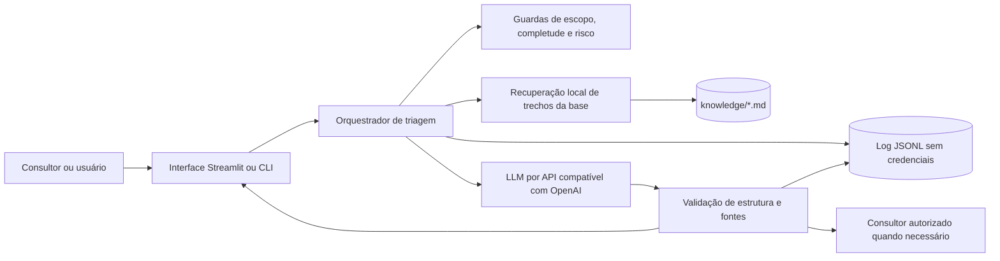

# Arquitetura da prova de conceito

## Decisões

1. **Recorte:** SAP S/4HANA, Materials Management, fluxo pedido de compra → entrada de mercadorias → verificação de fatura. Os demais módulos ficam fora do escopo. O recorte evita misturar comportamentos de produtos SAP diferentes.
2. **Dados locais:** oito chamados e cinco artigos curtos. Os artigos distinguem fatos baseados no SAP Help da política fictícia do protótipo.
3. **Recuperação antes da geração:** o sistema seleciona trechos relevantes da base; o LLM recebe o chamado, os trechos e regras explícitas para citar somente esses IDs. A seleção é lexical e reproduzível. Isso mantém a prova de conceito executável sem banco vetorial.
4. **Limites de autonomia:** a IA apenas orienta. Liberação de fatura/pagamento, aprovação de pedido, alteração de tolerâncias e lançamentos permanecem com pessoas autorizadas.
5. **Auditoria:** grava ID, horário, chamado, classificação, resposta e fontes em JSONL local. O protótipo mascara identificadores longos, segredos e alguns dados pessoais antes do envio ao modelo e do registro. Para uso real, seriam necessárias regras de mascaramento validadas pelo cliente, retenção e controle de acesso.
6. **Sem integração real:** os números de documentos são fictícios. O assistente nunca declara que consultou o SAP ou que confirmou um estado no ambiente.

## Possível evolução com SAP real

Usar APIs oficiais ou serviços expostos pelo ambiente do cliente, com identidade técnica de leitura, permissões mínimas, filtragem por sociedade e trilha de auditoria. Nenhuma escrita seria liberada pela IA: operações sensíveis exigiriam fluxo de aprovação existente e usuário autorizado. A escolha exata da API depende da edição e versão do S/4HANA implantado.
